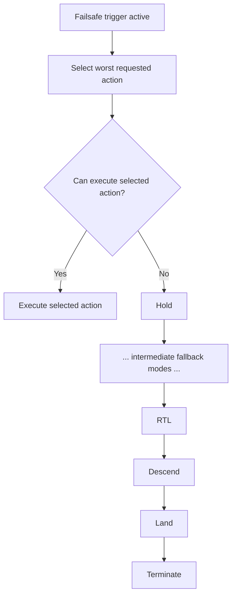

# PX4 Failsafe Chain Teardown

## Introduction

Complex systems rarely fail because of a single bug.

They fail when implicit assumptions between components are violated — especially as the system evolves.

This teardown analyzes a safety critical failure mode in ArduPlane’s landing logic that emerges from such an assumption.

It focuses not on a specific bug, but on how change can silently break system invariants.

## Executive Summary

PX4 has a failsafe system, that ensures a safe handling of system failures (e.g. data link loss failures or battery failures). Possible handlings might be holding, return-to-launch or landing. Depending on the failure, a different action is chosen, which should ensure a safe behaviour. These actions have an escalating order of severity, and if one action cannot run for a given reason, the next more "severe" action is attempted to be performed. This failsafe action chain continues until an action is found that can be performed.

This is implemented as a chain of falling-through switch-cases. If a new action is implemented, which can be performed in case of a certain system failure, and integrated into this falling through chain, this can be risky. The new action may be appropriate for some system failures, e.g. data link loss, but inappropriate for other system failures, like low battery. 

This failsafe chain implementation silently assumes, that the order of its actions is always escalating, and that the appropriateness of an action is always correct for all system failures. There is no explicit check that ensures that certain actions are only chosen for certain system failures.

The implementation invites developers who are new to PX4 and who don't have global knowledge of the failsafe system to add new failsafe actions into this fallthrough chain as a means to let the code select this new action, without realizing the implicit main purpose of this chain: To change the intially selected action to action that can run.

## System Context

**Relevant modules:**
`framework`
`failsafe`

The failsafe chain currently works as follows:

## Hidden Invariant

## Change Risk: Why this is fragile

Global behaviour depends on non-local coupling

## Failure Mode

## Experiment

## Key Insight

## Reference 