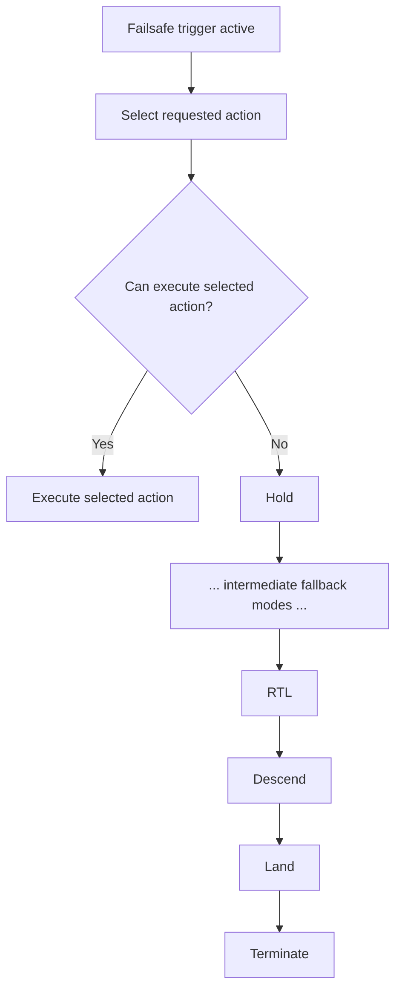
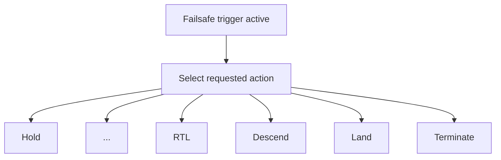

# PX4 Failsafe Chain Teardown

## Introduction

Complex systems rarely fail because of a single bug.

They fail when implicit assumptions between components are violated — especially as the system evolves.

This teardown analyzes a safety critical failure mode in ArduPlane’s landing logic that emerges from such an assumption.

It focuses not on a specific bug, but on how change can silently break system invariants.

## Executive Summary

PX4 has a failsafe system that ensures a safe handling of system failures (e.g. data link loss failures or battery failures). Possible handlings might be holding, return-to-launch or landing. Depending on the failure, a different action is chosen, which should ensure a safe behaviour. These actions have an escalating order of severity, and if one action cannot run for a given reason, the next more "severe" action is attempted to be performed. This failsafe action chain continues until an action is found that can be performed.

This is implemented as a chain of falling-through switch-cases. If a new action is implemented, which can be performed in case of a certain system failure, and integrated into this falling through chain, this can be risky. The new action may be appropriate for some system failures, e.g. data link loss, but inappropriate for other system failures, like low battery. 

This failsafe chain implementation silently assumes, that the order of its actions is always escalating, and that the appropriateness of an action is always correct for all system failures. There is no explicit check that ensures that certain actions are only chosen for certain system failures.

The implementation invites developers who are new to PX4 and who don't have global knowledge of the failsafe system to add new failsafe actions into this fallthrough chain as a means to let the code select this new action, without realizing the implicit main purpose of this chain: To change the intially selected action to action that can run.

## System Context

**Relevant modules:**
`framework`
`failsafe`

The failsafe chain currently works as follows:

## Hidden Invariant

> **🚨**
> All failsafe actions must fit a single global priority and fallback ordering, where “higher” actions are always safer/more appropriate than “lower” ones across every trigger context. The chain only works correctly if every newly added action is placed so that this implicit ordering still preserves cause-specific intent (for example, battery-critical intent must not be accidentally outranked and rewritten by unrelated actions).

## Change Risk: Why this is fragile

The failsafe fallthrough chain is implemented in a way that can easily be misunderstood as a dispatcher, i.e. a switch-case, that is simply responsible for for checking if the selected action can run, meaning like this:

This would be a very reasonable place to add an entry if a new failsafe action should be added.

This gap between expected dispatcher semantics and actual fallthrough-rewrite semantics is a core change risk, as a new failsafe action may be added to the supposed dispatcher, without being aware of the importance of its structure.

The cause of the fragility is that correctness depends on an implicit contract spread across action ranking, switch fallthrough, and mode-availability checks rather than one explicit policy definition. 

A developer can make a locally reasonable change, such as inserting a new action that appears to handle one edge case, but unintentionally alter global behavior for unrelated triggers by changing which action wins or where fallback lands. 

Since the chain rewrites the selected action as it falls through, small ordering edits can silently violate cause-specific intent, for example allowing a battery-critical response to be replaced by a different action that happens to be “higher” or encountered in fallback flow. 

In short, the design is change-sensitive: minor modifications can produce major behavioral shifts without obvious compile-time or structural safeguards.

## Failure Mode

If the actually selected action cannot run for whatever reason, the fallthrough chain falls through to the next, more severe action. If a new failsafe action was added to the chain that is unsafe for certain system failures, this can lead to a crash in the worst case.

## Experiment

To prove that this can happen, a new failsafe action was introduced: Climb and Hold.
This action is reasoned for the case where we have a data link loss at very low altitudes. To ensure that we are out of danger from near ground obstacles, the drone climbs to a safe altitude and holds there, so that the data link may be recovered. 

This new action is placed after RTL in the severity ranking, as RTL is mission recovery and Climb and Hold is immediate hazard mitigation, which can be treated as more severe when hazard risk dominates.

The drone takes off and the battery drains to the critical level, where RTL should normally be triggered. If this can't run for any reason, the failsafe chain now selects Climb and Hold as the next more severe action. 

**Expected**: Drone switches to Land mode and lands where it is.

**Actual**: With a low battery, the drone climbs and holds, leading to the imminent risk of complete battery drain while at a significant altitude.

## Key Insight

Safety critical mode selection must not rely on the implicit structure of a function. If this is the case, structure changes of this function, be they refactorings or additions of new modes, may silently violate this invariant without the compiler discovering this at build time. This invariant must be made explicit.

## Reference 

For deeper insight, please take a look at the [analysis](analysis).

For recommendations and learnings based on this teardown, please see [recommendations](recommendations).